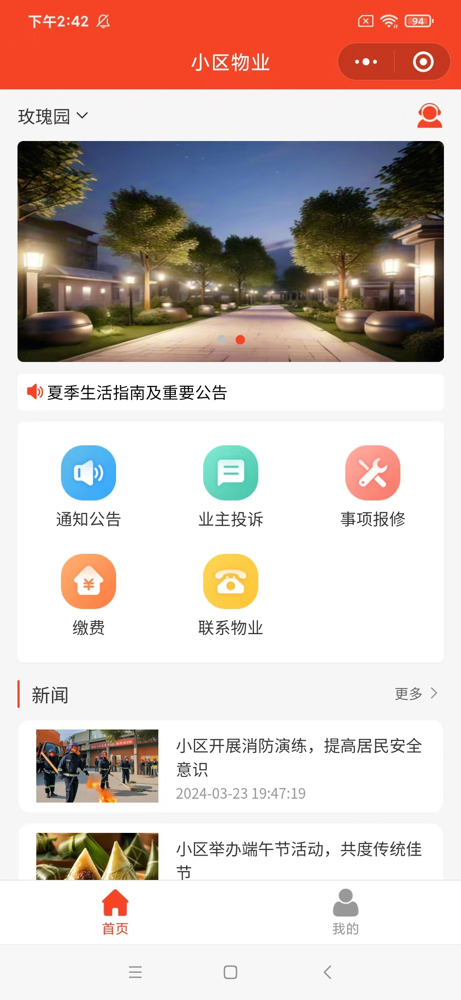
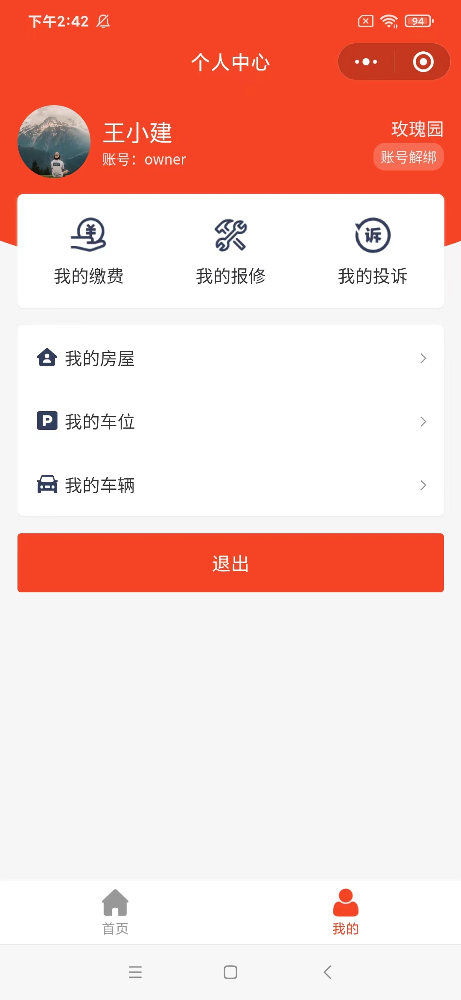
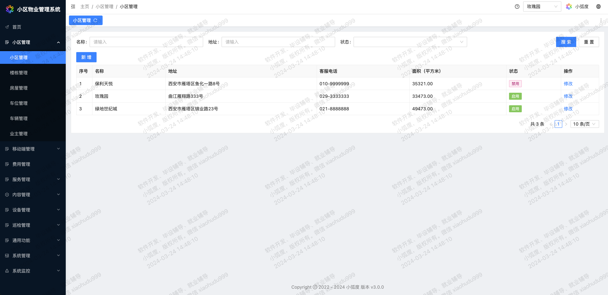
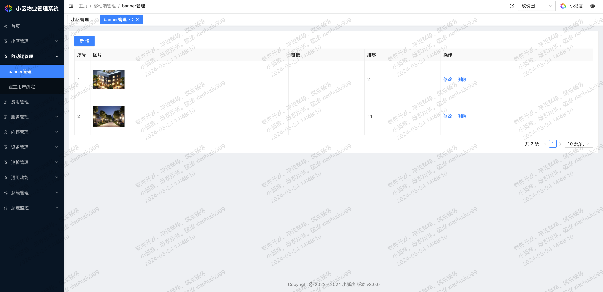
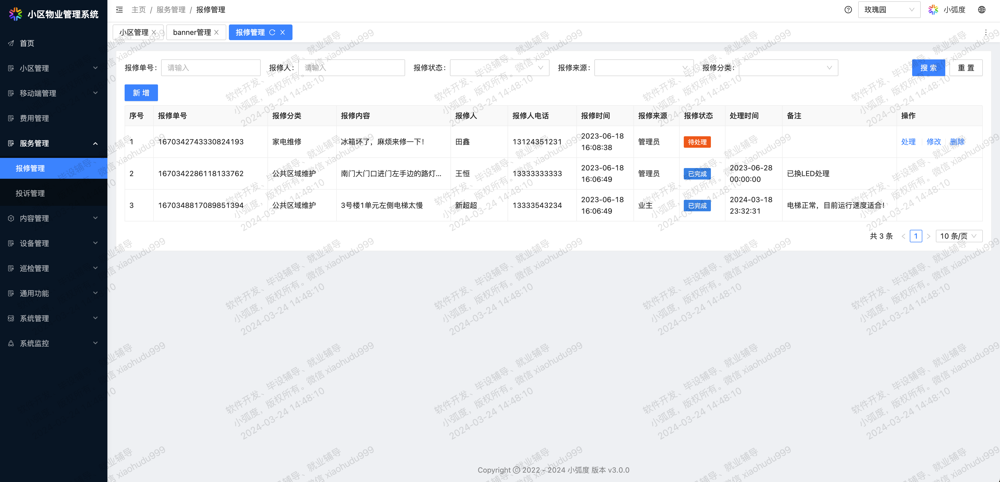

# 小区物业管理系统V3

#### 系统介绍
该系统既适用于企业用户，也适用于学生用户，企业用户可以用此系统进行物业管理，学生用户可以用我们的系统进行毕业设计、论文撰写等。  
这是一款后端基于 Spring Boot，前端基于 Vue 的前后端完全分离的小区物业管理系统。
tip：  
1、V3版本增加了用户端，支持微信小程序端和H5端，基于uniapp开发；  
2、V3版本对原有模块进行了重构升级，并增加了缴费、设备、巡检等模块。

#### 系统优势
 **1、技术先进、文档完备，方便学习和二开；**   
-- 不同于市面上的一些N年前的陈年老项目，技术老旧，文档匮乏，上手难度大。  
 **2、完全自主开发，源码可控；**   
-- 不同于市面上过了N手的项目，源码架构和系统功能完全不可控，何谈专业指导。  
 **3、后端阿里规约，前端 ESLint 和 Prettier，规范代码；**   
-- 不同于市面上一些项目，代码质量低、缺少注释，理解以及上手成本剧增。  
 **4、不断的更新和维护，完善系统功能；**   
-- 不同于市面上一些N年如一日的项目，停滞不前、功能长期不变。  
 **5、在线地址访问，所见即所得。**   
-- 不同于市面上一些“塑料”系统，bug太多，只有一些截图。

#### 用户端系统演示
|    H5二维码    |  |
|:-------------:|:-------------:|
| 微信小程序二维码 |  |
| 业主账号密码 | owner/admin |

#### 管理端系统演示
演示地址：http://www.xiaohudu.com/demo/community-admin-v3  
演示管理员账号：admin  
演示管理员密码：admin  
小区管理员账号：community_admin  
小区管理员密码：admin

#### tip
1、该账号提供了该系统所有功能的展示，部分系统级功能做了 API 级别的限制，仅供功能展示用途；  
2、系统不断地更新迭代，实际功能以线上演示为准，与其他部分文字、图片介绍可能会有所偏差。

#### 系统部分截图

|  |  |
|:-------------------:|:-------------------:|

